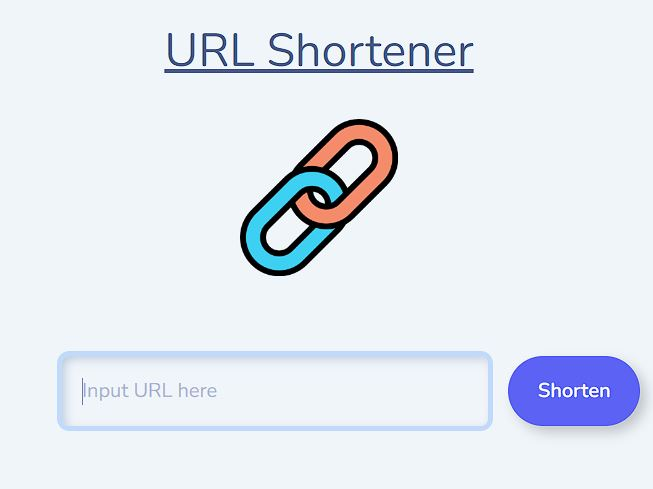

# URL shortener



## 介紹

可將冗長網址縮短

## 功能

1. 縮短網址
2. 點擊 copy 可複製進入剪貼本
3. ctrl+v/cmd+v 即可將短網址貼上

## 開始使用

1. 請確認已安裝 node.js、npm、MongoDB(使用版本請見文件最下方)
2. 下載或 clone 此專案至本地資料夾

   ```bash
   git clone https://github.com/dinsky21/Restaurant-List.git
   ```

3. 在資料夾建立.env 檔案，並將以下 code 複製進入此檔案，並注意須將中文區域更改為個人的 mongoDB 資訊

```bash
MONGODB_URI =
  "mongodb+srv://(mongodb 帳號):(密碼)@cluster0.w9mfqtb.mongodb.net/(MongoDB資料庫名稱)?retryWrites=true&w=majority"
```

4. 請先執行以下指令，建立種子資料

```bash
npm run seed
```

5. 若要啟網站，使用 terminal 於該資料夾內執行

   ```bash
   npm run dev
   ```

6. 若看見下方訊息則代表網站順利運行，打開瀏覽器輸入網址 localhost:3000 可開始使用

   ```bash
   Express is listening on port (PORT)
   ```

7. 若需結束 local hosting，請於 terminal 內按下 ctrl + c 即可

## 開發工具

- node.js 16.17.0
- Express 4.17.1
- Express-Handlebars 6.0.6
- Bootstrap 5.1.3
- Font Awesome 5.8.1
- mongoose 5.9.7
- dotenv 16.0.2
- method-override 3.0.0
- body-parser 1.19.0
